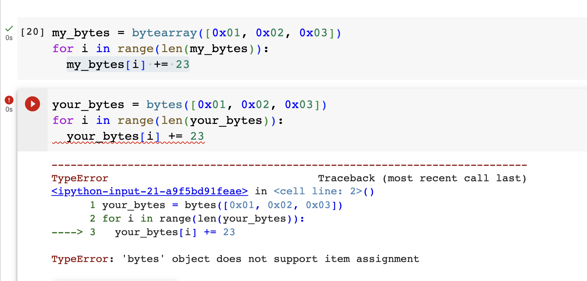

# Handling bytes in Python

Python has two classes for handling byte data -- bytes() and bytearray().

The two classes are similar, but with one crucial difference: bytes() are immutable while bytearray() is mutable.

